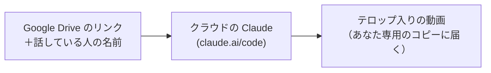

# meet-telop-kit

[🇺🇸 English](README.md) ｜ **🇯🇵 日本語** ｜ [🇨🇳 简体中文](README.zh.md) ｜ [🇹🇭 ไทย](README.th.md)

対談の録画から、YouTube 風のテロップ入り「約5分の動画」を作るキットです。 
編集に時間がかかって、録画が使われないまま眠っている人のためのツールです。 
文章を1つ送るだけで、クラウドの Claude が切り出し・テロップ入れをして、あなた専用のコピーに動画を届けます。

**インストール不要。録画が、そのまま出せる動画になります。**

🔧 [エンジニア向けドキュメント](docs/engineering.ja.md) ｜ 📘 [詳細仕様](.claude/skills/meet-interview-edit/SKILL.md)

[困りごと](#problems) ｜ [できること](#what-it-does) ｜ [必要なもの](#requirements) ｜ [使いはじめる](#get-started) ｜ [安心の理由](#safety) ｜ [ドキュメント](#docs) ｜ [ライセンス](#license)

---

## こんな経験はありませんか？

- **録画がたまる一方** — いい対談なのに、Google Drive に置いたまま使っていない
- **編集ソフトが難しい** — カット・字幕・効果を入れる技術がない
- **テロップに何時間も** — 字幕や名前の表示を手で打つだけで1日が終わる
- **外注は高い** — 対談のたびに編集をお願いすると費用がかさむ

---

## できること

Google Drive の共有リンクと話している人の名前を渡すと、Claude Code on the web（クラウドで動く Claude）がクラウドのパソコンで編集し、できた動画をこのキットのあなた専用のコピーに届けます。

- 🎬 **約5分の広告版**

  対談の中から印象的な冒頭と質問・回答の部分を選んで、約5分にまとめます。

- 💬 **YouTube 風のテロップ**

  話している人の字幕・名前のプレート・質問の見出し・数字のポップ・効果音・エンドカードが入ります。

- 🖼️ **書き出す前に確認**

  先に静止画を見せてくれるので、直したいところを普通の文章で伝えられます。

- 📦 **あなた専用のコピーに届く**

  完成した mp4 は、あなた自身の GitHub リポジトリ（自分専用の保管場所）に届き、そこからダウンロードできます。

---

## 使うのに必要なもの

作業はすべてブラウザの claude.ai/code の中で進みます。パソコンの性能は関係ありません。

- **Claude のアカウント** — Pro / Max / Team / Enterprise のどれか
- **GitHub のアカウント** — 無料。動画はそこに作るプライベートな保管場所に届きます
- **Google Drive に置いた録画** — と、写っている人全員の了解

| 項目 | 状態 | 補足 |
| :- | :- | :- |
| パソコンのブラウザで Claude Code on the web | ✅ | |
| Claude Desktop アプリ（Cloud） | ⚠️ | 未検証 |
| iPhone の Claude アプリ（Code タブ） | ⚠️ | このキットでは未検証。この手順はパソコンのブラウザ向けに書いて確かめたものなので、設定はパソコンで |
| クラウドのパソコン: Ubuntu 24.04 | ✅ | Claude Code on the web が用意する環境 |
| macOS でのテスト実行（`make test`） | ✅ | |
| Claude のプラン | 必須 | Pro / Max / Team / Enterprise（Anthropic の案内による・2026-10-05 時点） |
| 録画のダウンロード: Google Drive の共有リンク（Meet の録画）・macOS | ✅ | `scripts/fetch_drive.sh` で実測（2026-10-05） |
| 録画のダウンロード: Google Drive の共有リンク・クラウドのパソコン | ⚠️ | 動作テストが確かめるのは Drive のサーバーにつながるかだけ。あなたの共有リンクは本番の最初に確かめます |
| 録画の置き場所: Google Drive に置いた Zoom の録画 | ⚠️ | 未検証 |

Team / Enterprise では、管理者（Owner）が Claude Code on the web と GitHub との連携を許可している必要があります。

---

## 使いはじめる

最初の1回だけ、3ステップです。どのステップにも、押すだけのリンクがあります。

| | やること | 開くリンク |
| :- | :- | :- |
| ① | **自分用のコピーを作る**（公開範囲は必ず **Private**） | <https://github.com/shojikumaru/meet-telop-kit/generate> |
| ② | **Claude とつなぐ・環境 `video` を作る** | <https://claude.ai/code> |
| ③ | **「動作テスト」と送る** | <https://claude.ai/code?prompt=%E5%8B%95%E4%BD%9C%E3%83%86%E3%82%B9%E3%83%88&environment=video> |

- **かかる時間（目安・見積もり）** — パソコンで 20〜30分 / アカウントを新しく作るなら さらに 10〜15分
- **動作テスト** — 目安 3〜6分。クラウドのパソコンから Google Drive と Hugging Face（文字起こしモデルの置き場）のサーバーにつながるかを確かめ、10秒のテスト動画がコピーに届けば準備完了です

録画から動画を作るとき: 録画を Google Drive で「リンクを知っている全員」に共有し、claude.ai/code で自分のコピーと環境 `video` を選んで、手順書の依頼文に名前を書き入れて送ります。Claude がリンクを確かめ、静止画で確認を取ってから動画を届けます（1本あたり 30分〜1時間くらい・目安）。

画面の場所やコピーして使う文章つきのくわしい手順は [docs/はじめに.md](docs/はじめに.md) にあります。

うまくいかないとき

- **「ネットワークにつながりません」** — 環境が `video` になっていないか、許可するドメインが違います
- **「共有されていません」** — Drive の共有を「リンクを知っている全員」にします
- **計画だけ返ってくる** — モードを「Plan」から「Auto」か「Accept edits」に変えて送り直します
- **コピーが一覧に出てこない** — Claude の GitHub アプリをコピーに入れます

ほかのケースは [docs/はじめに.md](docs/はじめに.md) の「7. うまくいかないとき」にあります。

---

## 安心して使える理由

録画も名前も、あなたが置いた場所から勝手に出ていかないように作っています。

- **コピーはプライベート** — 動画はあなた専用のコピーにだけ届き、ほかには送りません
- **名前を勝手に作らない** — 名前や肩書きが足りないときは、Claude が質問します
- **Drive の共有は作業中だけ** — 動画が届いたら「制限付き」に戻します
- **つながる先を限定** — クラウドのパソコンがつながれるのは、決めた6つのドメインとパッケージ取得先だけです
- **了解を取るのはあなた** — 録画に写っている人全員に、動画にしてよいか先に聞いてください

---

## もっと詳しく

| ドキュメント | 読む人 | 内容 |
| :- | :- | :- |
| [docs/はじめに.md](docs/はじめに.md) | 使う人全員 | 最初の設定・動作テスト・動画の作り方・困ったとき |
| [docs/engineering.ja.md](docs/engineering.ja.md) | エンジニア | 処理の流れ・モジュール・お届けの仕組み・テスト・設定 |
| [docs/engineering.md](docs/engineering.md) | エンジニア（英語） | 同じ内容の英語版 |
| [.claude/skills/meet-interview-edit/SKILL.md](.claude/skills/meet-interview-edit/SKILL.md) | エンジニア | Claude が従う作業手順（詳細仕様） |
| [templates/edl_template.py](templates/edl_template.py) | エンジニア | 動画の設計図（カットとテロップ）のひな形 |
| [CONTRIBUTING.md](CONTRIBUTING.md) | 協力してくれる人 | Issue・テスト・書いてはいけないもの |
| [SECURITY.md](SECURITY.md) | 使う人全員 | セキュリティの問題の報告のしかた |

---

## ライセンス

[MIT](LICENSE) です。誰でも無料で使い、自分の仕事に合わせて作り変えてほしいので、MIT にしています。

---

**インストール不要** ｜ **claude.ai/code で動く** ｜ **あなた専用のコピーに届く**

