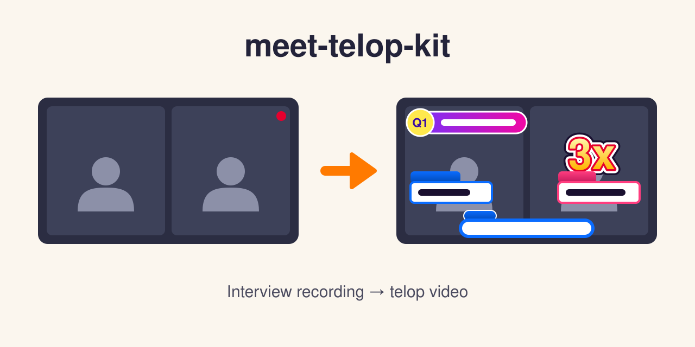
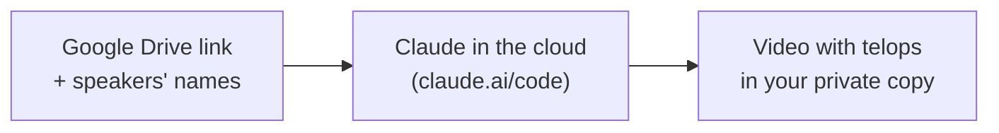

# meet-telop-kit

**🇺🇸 English** ｜ [🇯🇵 日本語](README.ja.md) ｜ [🇨🇳 简体中文](README.zh.md) ｜ [🇹🇭 ไทย](README.th.md)

A kit that turns an interview recording into a ~5 minute YouTube-style video with telops. 
For recordings that pile up unused because editing takes too long. 
You send one message; Claude in the cloud cuts it, adds the telops and delivers the video to your private copy.

**Nothing to install. Your recording becomes a ready-to-post video.**

🔧 [Engineering docs](docs/engineering.md) ｜ 📘 [Detailed spec](.claude/skills/meet-interview-edit/SKILL.md)

[Problems](#problems) ｜ [What it does](#what-it-does) ｜ [Requirements](#requirements) ｜ [Get started](#get-started) ｜ [Why it is safe](#safety) ｜ [Docs](#docs) ｜ [License](#license)

---

## Does this sound familiar?

- **Recordings pile up** — good interviews sit in Google Drive and are never used
- **Editing software is hard** — cutting, subtitles and effects take skills you do not have
- **Telops take hours** — typing every subtitle and name plate by hand eats a whole day
- **Outsourcing costs money** — paying an editor for every interview does not add up

---

## What it does

You give a Google Drive share link and the speakers' names; Claude Code on the web does the editing on a cloud computer and puts the finished video into your own private copy of this kit.

- 🎬 **A ~5 minute ad cut**

  Claude picks a strong opening and the question-and-answer parts of the interview and cuts them to about 5 minutes.

- 💬 **Telops in a YouTube style**

  Speaker subtitles, name plates, question headers, pop-up numbers, sound effects and an end card.

- 🖼️ **Check before export**

  Claude shows still images first; you ask for changes in plain words before the video is written out.

- 📦 **Delivered to your private copy**

  The finished mp4 lands in your own GitHub repository, ready to download.

The telops, the step-by-step guide and Claude's replies are in Japanese.

---

## Requirements

Everything runs in the browser at claude.ai/code; your computer's power does not matter.

- **Claude account** — a Pro, Max, Team or Enterprise plan
- **GitHub account** — free; the video is delivered to a private repository there
- **Recording on Google Drive** — plus the consent of everyone in it

| Item | Status | Note |
| :- | :- | :- |
| Claude Code on the web in a computer browser | ✅ | |
| Claude Desktop app (Cloud) | ⚠️ | not tested |
| iPhone Claude app (Code tab) | ⚠️ | not tested with this kit; this guide was written for and tested in a computer browser, so do the setup on a computer |
| Cloud computer: Ubuntu 24.04 | ✅ | the environment Claude Code on the web provides |
| Local test run on macOS (`make test`) | ✅ | |
| Claude plan | Required | Pro / Max / Team / Enterprise, as documented by Anthropic (2026-10-05) |
| Recording download: Google Drive share link (Meet recording), macOS | ✅ | measured with `scripts/fetch_drive.sh` (2026-10-05) |
| Recording download: Google Drive share link, cloud computer | ⚠️ | the 動作テスト checks only that the Drive hosts are reachable; your own share link is checked at the start of a real job |
| Recording source: Zoom recording placed on Google Drive | ⚠️ | not tested |

Team / Enterprise: an Owner must allow Claude Code on the web and the GitHub connection.

---

## Get started

Three steps, once. Each step has a one-tap link.

| | Do this | Open |
| :- | :- | :- |
| ① | **Make your own copy** (visibility must be **Private**) | <https://github.com/shojikumaru/meet-telop-kit/generate> |
| ② | **Connect Claude and create the environment `video`** | <https://claude.ai/code> |
| ③ | **Send 「動作テスト」** (the setup check) | <https://claude.ai/code?prompt=%E5%8B%95%E4%BD%9C%E3%83%86%E3%82%B9%E3%83%88&environment=video> |

- **Time (estimates)** — 20–30 min on a computer, 10–15 min more with new accounts
- **動作テスト** — about 3–6 min (estimate); it checks that the cloud computer can reach the Google Drive and Hugging Face (speech model) servers, and a 10-second test video arriving in your copy means you are ready

Making a video from a recording: share the recording on Google Drive as "Anyone with the link", open claude.ai/code with your copy and the `video` environment, and send the request text from the guide with the speakers' names filled in. Claude checks the link, shows stills for your OK and delivers the video (about 30 min to 1 hour per video, an estimate).

The full guide, with where to click and text to copy, is [docs/はじめに.md](docs/はじめに.md) (Japanese).

When something goes wrong

- **"ネットワークにつながりません" (cannot reach the network)** — the session is not in the `video` environment, or its allowed domains are wrong
- **"共有されていません" (not shared)** — set the recording's Drive sharing to "Anyone with the link"
- **Only a plan comes back** — switch the mode from "Plan" to "Auto" or "Accept edits" and send again
- **Your copy is not listed** — install the Claude GitHub App on your copy

The full list is in section 7 of [docs/はじめに.md](docs/はじめに.md).

---

## Why it is safe to use

The kit is built so that recordings and names stay where you put them.

- **Your copy is private** — the video is delivered only to your own private copy, nowhere else
- **Names are never invented** — when a name or title is missing, Claude asks you
- **The Drive link is shared only while working** — set it back to "Restricted" once the video arrives
- **Limited network** — the cloud computer may reach only 6 listed domains and package managers
- **Consent is on you** — ask everyone in the recording before you make a video of it

---

## Learn more

| Document | For | Content |
| :- | :- | :- |
| [docs/はじめに.md](docs/はじめに.md) | everyone (Japanese) | setup, 動作テスト, making a video, troubleshooting |
| [docs/engineering.md](docs/engineering.md) | engineers | pipeline, modules, delivery, tests, settings |
| [docs/engineering.ja.md](docs/engineering.ja.md) | engineers (Japanese) | the same in Japanese |
| [.claude/skills/meet-interview-edit/SKILL.md](.claude/skills/meet-interview-edit/SKILL.md) | engineers | the procedure Claude follows (detailed spec) |
| [templates/edl_template.py](templates/edl_template.py) | engineers | the video plan template: cuts and telop cues |
| [CONTRIBUTING.md](CONTRIBUTING.md) | contributors | issues, tests, what never to post |
| [SECURITY.md](SECURITY.md) | everyone | how to report a security problem |

---

## License

[MIT](LICENSE). We want anyone to use it for free and adapt it to their own work, so it is MIT.

---

**Nothing to install** ｜ **Runs in claude.ai/code** ｜ **Delivered to your private copy**

