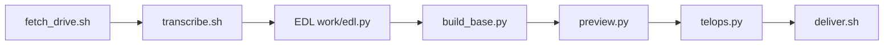

[← README](../README.ja.md) ｜ [English](engineering.md) ｜ 日本語

# meet-telop-kit — エンジニア向けドキュメント

Google Drive の録画からテロップ入り動画を作る仕組み、各ファイルの役割、動画の届け方、テストの方法をまとめています。詳細仕様は Claude が従う作業手順 [.claude/skills/meet-interview-edit/SKILL.md](../.claude/skills/meet-interview-edit/SKILL.md) と EDL のひな形 [templates/edl_template.py](../templates/edl_template.py) です。このページでは中身を繰り返さず、そちらへリンクします。

---

## クイックスタート

ツールが入ったパソコンで（Linux: `scripts/setup.sh` が apt で入れます / macOS: 確認だけして `brew` の案内を出します）:

```bash
bash scripts/setup.sh                              # システムのパッケージ + Python の venv（何度実行しても同じ）
make test                                          # スモークテスト、約20秒
SELFTEST_NO_DELIVER=1 bash scripts/selftest.sh     # お届けを省いた動作テスト
```

ふだんの使い方では手元では何も動かしません。Claude Code on the web がクラウドのセッションでこれらを実行します（README 参照）。

---

## 処理の流れ



- **fetch_drive** — 「リンクを知っている全員」の Drive ファイルを `drive.usercontent.google.com` から取得（再開可能。`--probe N` は先頭 N バイトだけ）
- **transcribe** — Meet の埋め込み字幕から話者つきの行（`--subs-only`）、選んだ区間だけ whisper
- **EDL** — カットとテロップの指示を書いた Python ファイル。Claude が `templates/edl_template.py` から書く
- **build_base** — カットしてつなぎ `base.mov` に（30fps、画面共有中のブラウザのバーをぼかし、最後を静止）
- **preview** — 要所の 960×540 静止画。本番の書き出し前に確認する
- **telops** — テロップを描き、効果音を合成し、loudnorm をかけて mp4 を書き出し、検査する
- **deliver** — mp4 を使う人の GitHub リポジトリに届ける（下記）

---

## モジュール

| 場所 | 役割 |
| :- | :- |
| `studio/config.py` | 共通のフラグと環境変数（`--edl`、`--work`、`--src`、`--source-offset`、`--limit`、`--out`、エンコーダ） |
| `studio/build_base.py` | カット + 連結 + ぼかし + 最後の静止 -> `base.mov`、`timeline.json`（既定は anchored タイミング） |
| `studio/telops.py` | テロップ層（Pillow）を `base.mov` に重ねて ffmpeg へ、効果音、loudnorm、出力の検査 |
| `studio/preview.py` | 指定時刻の静止画 -> `<work>/prev/<t>.jpg` |
| `studio/fonts.py` | W6 / W8 / W9 の太さを解決（macOS はヒラギノ、Linux は Noto Sans CJK JP） |
| `studio/asr.py` | whisper -> トークン時刻つき JSON（PATH に `whisper-cli` があればそれ、なければ pywhispercpp） |
| `studio/tok.py` | whisper のトークンから文字単位で時刻を引く |
| `studio/phrases.py` | 無音で区切ったフレーズと文字。正確なカット位置を決めるため |
| `studio/subs.py` | Meet の字幕ストリームから話者つきの書き起こし |
| `scripts/setup.sh` | 何度実行しても同じ準備（Linux: apt + `~/.cache/meet-telop/venv` の venv / macOS: 確認）。`--model` で 574MB の whisper モデルを取得 |
| `scripts/fetch_drive.sh` | Drive のダウンロード / 確認。失敗の原因ごとに英語1行 + 日本語1行 |
| `scripts/transcribe.sh` | `--from`..`--to` の音声を取り出して whisper、または `--subs-only` |
| `scripts/selftest.sh` | 動作テスト（下記） |
| `scripts/deliver.sh` | GitHub へのお届け（下記） |
| `scripts/shrink.sh` | ブランチでのお届け用に 90MB 以下へ再エンコード（1080p・音声はそのまま） |
| `scripts/compare.sh` | 基準の動画との長さ + SSIM の比較 |
| `scripts/_lib.sh` | リポジトリの場所、キャッシュの場所、モデルの URL、`pick_python` |
| `tests/smoke.sh` | 12秒の合成素材 -> base -> テロップ -> 静止画、加えてエラー時の確認 |
| `tests/smoke_edl.py`、`tests/smoke_anchored_edl.py`、`tests/selftest_edl.py` | スモークテストと動作テスト用の EDL |
| `templates/edl_template.py` | EDL のひな形（すべてのキーに説明つき） |
| `.claude/skills/meet-interview-edit/SKILL.md` | Claude が従う作業手順（動作テストモードと fresh モード） |

---

## お届けの仕組み

`scripts/deliver.sh <file> [tag]` は次の順に試し、アップロードを確認できた最初の方法で止まります。

- **gh** — `gh` コマンドで Release に添付（クラウドでは GitHub のプロキシで失敗することがある）
- **rest** — 本物の `GH_TOKEN` / `GITHUB_TOKEN` で REST API から Release に添付。クラウドではトークンが `proxy-injected` という仮の値なので使わない
- **branch** — mp4 + README だけの孤立コミットを `deliver/<tag>` として普通の `git push` で送る。クラウドで使えるのはこの方法

branch は 95MB 以上のファイルを断ります（GitHub は 100MB を超えるファイルの push を拒否するため）。`scripts/shrink.sh` で 1080p のまま 90MB 以下に再エンコードします。強制 push はせず、作業中のチェックアウトにも触りません。表示するリンクは、実際に push したリポジトリのものです。

---

## 動作テスト

`scripts/selftest.sh` は録画なしで5段階を実行します。

1. **ネットワーク** — `https://drive.google.com/robots.txt` と `https://drive.usercontent.google.com/robots.txt` が 200 で本文に `User-agent` を含むこと、`https://lh3.googleusercontent.com/robots.txt` が 400 / 404 / 200 のどれかを返すこと（`*.googleusercontent.com` の許可の行を通る確認。2026-10-06 の実測では Google は 400、403 / 407 や curl のエラーは不合格）、`huggingface.co` の whisper モデルの URL が `*.hf.co` の CDN へ転送された先で先頭1バイトに 200 / 206 を返すこと。1回 20秒まで、それ以外の応答は不合格
2. **準備** — `scripts/setup.sh`
3. **スモーク** — `tests/smoke.sh`
4. **書き出し** — 約10秒のデモ（カラーバー + 音、中立な話者2人、フックの見出し、Q の見出し、ポップ、名前のプレート、エンドカード）を `out/selftest.mp4` へ。長さと音声を検査
5. **お届け** — `scripts/deliver.sh out/selftest.mp4 selftest-<UTC の日時>`

ネットワークの確認で分かること: セッションが Drive のホスト、`*.googleusercontent.com` のワイルドカード、モデルのダウンロード先につながること。分からないこと: 使う人の録画そのもの（リンクが正しく共有されているか、ダウンロード回数の上限、Drive がそのファイルに使う `doc-*.googleusercontent.com` のホスト）。fresh モードは最初に `scripts/fetch_drive.sh "<link>" work/src/probe.bin --probe` でそれを確かめます。

---

## クラウドの制約

- **VM** — Ubuntu 24.04 x86_64、4 vCPU、16GB RAM、30GB ディスク、GPU なし
- **ネットワーク** — 環境 `video` のドメインだけ（Drive / Hugging Face の6ドメイン + パッケージ取得先）
- **長い処理** — 前面のコマンドは2分で裏に回されるので、長い処理は `nohup setsid … &` で動かして様子を見る
- **放置された VM** — 一時停止し、あとでファイルごと回収されることがあるので、mp4 は書き出したらすぐ届ける
- **GitHub** — ブランチの push は通し、タグは通さないプロキシ経由。そのため `deliver/<tag>` で届ける

---

## テスト

| コマンド | 実行するもの | 時間 |
| :- | :- | :- |
| `make test` | `tests/smoke.sh`: フレーム数、長さ、音声、テロップが見えること、静止画、フラグの打ち間違い、短すぎる base、素材の終わりを越えるカット、anchored タイミング | 約20秒 |
| `make selftest` | `scripts/selftest.sh`（動作テスト。お届けも含む。手元では `SELFTEST_NO_DELIVER=1`） | クラウドで 3〜6分（目安） |

CI（`.github/workflows/test.yml`）は main への push とプルリクエストのたびに、ubuntu-24.04 で `scripts/setup.sh` と `make test` を実行します。

---

## 設定

| 変数 | 効果 |
| :- | :- |
| `SELFTEST_NO_NET=1` | 動作テストのネットワーク確認を省く |
| `SELFTEST_NO_DELIVER=1` | 動作テストのお届けを省く |
| `DELIVER_VIA` | お届けの方法と順番。例 `branch`、既定は `gh,rest,branch` |
| `DELIVER_REMOTE` | branch で push するリモートの名前か URL（既定 `origin`） |
| `GH_REPO` | Release で使う `owner/name`（既定は `origin` から読み取る） |
| `STUDIO_EDL`、`STUDIO_WORK`、`STUDIO_SRC`、`STUDIO_SOURCE_OFFSET`、`STUDIO_LIMIT`、`STUDIO_OUT` | `studio/*.py` のフラグ `--edl`、`--work`、`--src`、`--source-offset`、`--limit`、`--out` と同じ |
| `STUDIO_VENC` | エンコーダの引数（既定: macOS は h264_videotoolbox、それ以外は libx264 veryfast crf 18） |
| `STUDIO_FONT_W6`、`STUDIO_FONT_W8`、`STUDIO_FONT_W9` | フォントの指定。`path` か `path#index` |
| `STUDIO_WHISPER_JSON` | `studio/tok.py` が読む whisper の JSON |
| `MEET_TELOP_CACHE` | venv とモデルを置くキャッシュの場所（既定 `~/.cache/meet-telop`） |
| `WHISPER_MODEL` | whisper モデルのパス（既定: キャッシュの中の large-v3-turbo q5_0） |

studio のスクリプトのすべてのフラグと EDL のキーは [SKILL.md](../.claude/skills/meet-interview-edit/SKILL.md)（「Settings reference」）と [templates/edl_template.py](../templates/edl_template.py) にあります。
