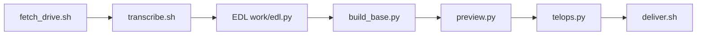

[← README](../README.md) ｜ English ｜ [日本語](engineering.ja.md)

# meet-telop-kit — engineering docs

How the kit turns a Google Drive recording into a telop video, what each file does, how the result is delivered and how it is tested. The detailed spec is the procedure Claude follows, [.claude/skills/meet-interview-edit/SKILL.md](../.claude/skills/meet-interview-edit/SKILL.md), and the EDL template [templates/edl_template.py](../templates/edl_template.py); this page links to them instead of repeating them.

---

## Quick start

On a computer with the tools installed (Linux: `scripts/setup.sh` installs them with apt; macOS: it checks them and prints `brew` hints):

```bash
bash scripts/setup.sh                              # system packages + Python venv (idempotent)
make test                                          # smoke test, ~20 s
SELFTEST_NO_DELIVER=1 bash scripts/selftest.sh     # the 動作テスト without the delivery step
```

In normal use nothing runs on your machine: Claude Code on the web runs these steps in a cloud session (see the README).

---

## Pipeline



- **fetch_drive** — downloads an "Anyone with the link" Drive file via `drive.usercontent.google.com` (resumable; `--probe N` reads only the first N bytes)
- **transcribe** — speaker lines from Meet's embedded captions (`--subs-only`), then whisper on the chosen segment only
- **EDL** — a Python file with the cuts and telop cues, written by Claude from `templates/edl_template.py`
- **build_base** — cut + concat to `base.mov` (30 fps, browser bar blurred during screen share, tail freeze)
- **preview** — 960×540 stills at key moments, checked before the full render
- **telops** — draws the telop layer, synthesises the sound effects, loudnorm, writes the final mp4 and checks it
- **deliver** — puts the mp4 into the user's GitHub repository (below)

---

## Modules

| Path | Role |
| :- | :- |
| `studio/config.py` | shared flags / env (`--edl`, `--work`, `--src`, `--source-offset`, `--limit`, `--out`, encoder) |
| `studio/build_base.py` | cut + concat + blur + tail freeze -> `base.mov`, `timeline.json` (anchored timing by default) |
| `studio/telops.py` | telop layer (Pillow) piped into ffmpeg over `base.mov`, sound effects, loudnorm, output check |
| `studio/preview.py` | stills for the given output times -> `<work>/prev/<t>.jpg` |
| `studio/fonts.py` | resolves the W6 / W8 / W9 weights (Hiragino on macOS, Noto Sans CJK JP on Linux) |
| `studio/asr.py` | whisper -> JSON with token times (`whisper-cli` when on PATH, else pywhispercpp) |
| `studio/tok.py` | character-level time lookup over the whisper tokens |
| `studio/phrases.py` | phrases between silences with their text, for exact cut points |
| `studio/subs.py` | speaker-labelled transcript from Meet's subtitle stream |
| `scripts/setup.sh` | idempotent setup (Linux: apt + venv in `~/.cache/meet-telop/venv`; macOS: checks); `--model` fetches the 574 MB whisper model |
| `scripts/fetch_drive.sh` | Drive download / probe with one English + one Japanese line per failure cause |
| `scripts/transcribe.sh` | audio extract + whisper for `--from`..`--to`, or `--subs-only` |
| `scripts/selftest.sh` | the 動作テスト (below) |
| `scripts/deliver.sh` | delivery to GitHub (below) |
| `scripts/shrink.sh` | re-encode under 90 MB (1080p, audio kept) for the branch delivery |
| `scripts/compare.sh` | duration + SSIM regression check against a reference video |
| `scripts/_lib.sh` | repo root, cache dir, model URL, `pick_python` |
| `tests/smoke.sh` | 12 s synthetic source -> base -> telops -> stills, plus error-path checks |
| `tests/smoke_edl.py`, `tests/smoke_anchored_edl.py`, `tests/selftest_edl.py` | EDLs for the smoke test and the 動作テスト |
| `templates/edl_template.py` | the EDL template (every key documented) |
| `.claude/skills/meet-interview-edit/SKILL.md` | the procedure Claude follows (動作テスト mode and fresh mode) |

---

## Delivery

`scripts/deliver.sh <file> [tag]` tries, in order, and stops at the first method whose upload it can verify:

- **gh** — a Release asset through the `gh` CLI (in the cloud a Release may fail through the GitHub proxy)
- **rest** — a Release asset through the REST API with a real `GH_TOKEN` / `GITHUB_TOKEN`; skipped in the cloud, where the token is only the placeholder `proxy-injected`
- **branch** — one orphan commit (the mp4 + a README) pushed as `deliver/<tag>` with plain `git push`; the route that works in the cloud

The branch route refuses files of 95 MB or more (GitHub rejects pushed files over 100 MB); `scripts/shrink.sh` re-encodes to 90 MB or less at 1080p. Nothing is force-pushed, the checkout is not touched, and the printed link names the repository that was actually pushed to.

---

## 動作テスト (setup check)

`scripts/selftest.sh` needs no recording and runs five steps:

1. **network** — `https://drive.google.com/robots.txt` and `https://drive.usercontent.google.com/robots.txt` must answer 200 with a body that contains `User-agent`; `https://lh3.googleusercontent.com/robots.txt` must answer 400, 404 or 200 (Google answered 400 there when measured on 2026-10-06; a 403 / 407 or a curl error fails), which exercises the `*.googleusercontent.com` allowlist line; the first byte of the whisper model URL on `huggingface.co` must answer 200 / 206 after its redirect to the `*.hf.co` CDN; each request is capped at 20 s, any other answer fails
2. **setup** — `scripts/setup.sh`
3. **smoke** — `tests/smoke.sh`
4. **render** — a ~10 s demo (colour bars + tone, two neutral speakers, hook title, Q header, pop, name plates, end card) to `out/selftest.mp4`, length and audio checked
5. **deliver** — `scripts/deliver.sh out/selftest.mp4 selftest-<UTC date-time>`

What the network step proves: the session can reach the Drive hosts, the `*.googleusercontent.com` wildcard and the model download. What it does not prove: anything about the user's own recording — whether the link is shared correctly, the download quota, and the `doc-*.googleusercontent.com` host Drive picks for that file. Fresh mode checks those first with `scripts/fetch_drive.sh "<link>" work/src/probe.bin --probe`.

---

## Cloud constraints

- **VM** — Ubuntu 24.04 x86_64, 4 vCPU, 16 GB RAM, 30 GB disk, no GPU
- **Network** — only the domains of the `video` environment (6 Drive / Hugging Face domains + package managers)
- **Long steps** — a foreground command is moved to the background after 2 min, so long steps run with `nohup setsid … &` and are polled
- **Idle VM** — pauses and may later be reclaimed with its files, so the mp4 is delivered as soon as it is rendered
- **GitHub** — through a proxy that allows pushing branches, not tags; hence the `deliver/<tag>` route

---

## Tests

| Command | What it runs | Time |
| :- | :- | :- |
| `make test` | `tests/smoke.sh`: frames, duration, audio, visible telops, stills, typo'd flags, truncated base, cut past the end, anchored timing | ~20 s |
| `make selftest` | `scripts/selftest.sh`, the 動作テスト (includes the delivery; use `SELFTEST_NO_DELIVER=1` locally) | 3–6 min in the cloud (estimate) |

CI (`.github/workflows/test.yml`) runs `scripts/setup.sh` and `make test` on ubuntu-24.04 for every push to main and every pull request.

---

## Settings

| Variable | Effect |
| :- | :- |
| `SELFTEST_NO_NET=1` | skip the network step of the 動作テスト |
| `SELFTEST_NO_DELIVER=1` | skip the delivery step of the 動作テスト |
| `DELIVER_VIA` | delivery methods and order, e.g. `branch` or `gh,rest,branch` (default) |
| `DELIVER_REMOTE` | remote name or URL for the branch push (default `origin`) |
| `GH_REPO` | `owner/name` for the Release routes (default: parsed from `origin`) |
| `STUDIO_EDL`, `STUDIO_WORK`, `STUDIO_SRC`, `STUDIO_SOURCE_OFFSET`, `STUDIO_LIMIT`, `STUDIO_OUT` | same as the `studio/*.py` flags `--edl`, `--work`, `--src`, `--source-offset`, `--limit`, `--out` |
| `STUDIO_VENC` | encoder arguments (default: h264_videotoolbox on macOS, else libx264 veryfast crf 18) |
| `STUDIO_FONT_W6`, `STUDIO_FONT_W8`, `STUDIO_FONT_W9` | font override, `path` or `path#index` |
| `STUDIO_WHISPER_JSON` | whisper JSON read by `studio/tok.py` |
| `MEET_TELOP_CACHE` | cache dir for the venv and the model (default `~/.cache/meet-telop`) |
| `WHISPER_MODEL` | path of the whisper model (default: the large-v3-turbo q5_0 file in the cache dir) |

All flags of the studio scripts and the EDL keys are in [SKILL.md](../.claude/skills/meet-interview-edit/SKILL.md) ("Settings reference") and [templates/edl_template.py](../templates/edl_template.py).
